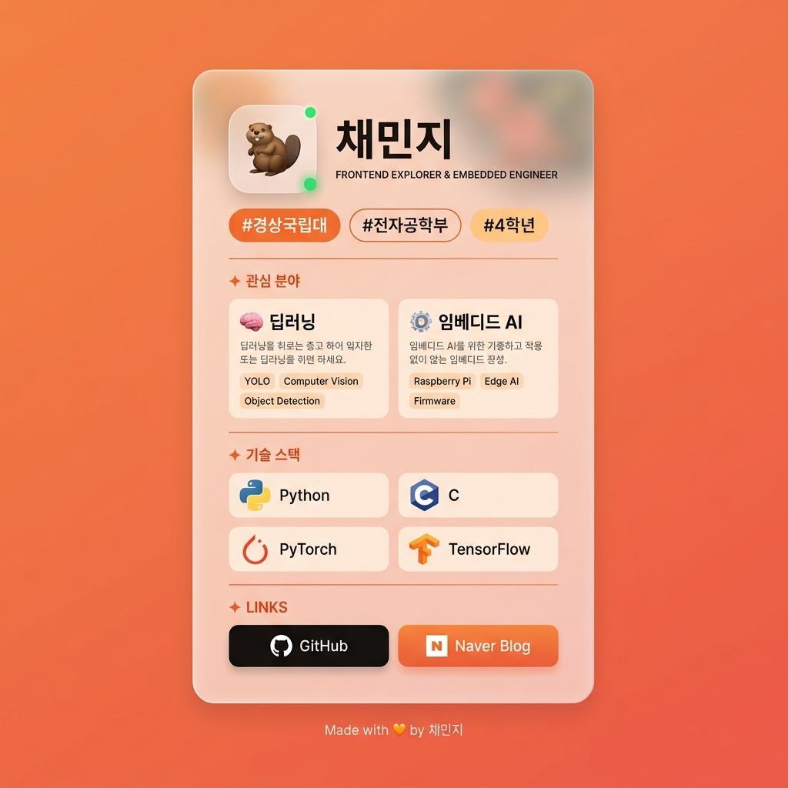

# 🦫 채민지 — About Me

> 경상국립대학교 전자공학부 4학년 | 딥러닝 · 임베디드 AI 관심 개발자

<br>

## 📸 실행 화면



<br>

## 🔗 바로가기

| 링크 | URL |
|---|---|
| 📄 페이지 | [index.html](./index.html) |
| 🐙 GitHub | [github.com](https://github.com/) |
| 📝 Naver Blog | [blog.naver.com/min_zz_ii](https://blog.naver.com/min_zz_ii) |

<br>

## 🗂️ 프로젝트 구조

```
about-me/
├── index.html   # 페이지 마크업 (시맨틱 HTML)
├── style.css    # 스타일 (능소화 컬러 팔레트 기반)
└── preview.png  # 실행 화면 미리보기
```

<br>

## ✨ 주요 구현 내용

| 섹션 | 내용 |
|---|---|
| 🦫 프로필 | 이름, 직무 타이틀, 소속 태그 (#경상국립대 · #전자공학부 · #4학년) |
| 🧠 관심 분야 | 딥러닝(YOLO, CV), 임베디드 AI(Raspberry Pi, Edge AI) |
| ⚡ 기술 스택 | Python · C · PyTorch · TensorFlow (devicons 아이콘) |
| 🔗 링크 | GitHub, Naver Blog |

<br>

## 🎨 디자인 포인트

- **능소화(凌霄花) 컬러 팔레트** — CSS 변수 토큰으로 색상 시스템 설계
- **Glassmorphism 카드** — `backdrop-filter: blur()` 활용한 유리 질감
- **마이크로 애니메이션** — 카드 등장, 호버 인터랙션, 배경 블롭 플로팅
- **반응형 레이아웃** — CSS Grid + 미디어 쿼리 (480px 이하 모바일 대응)

<br>

## 🛠️ 기술 스택


